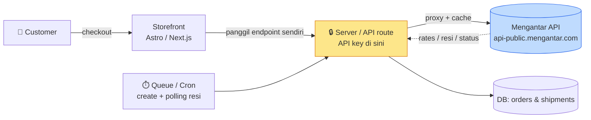
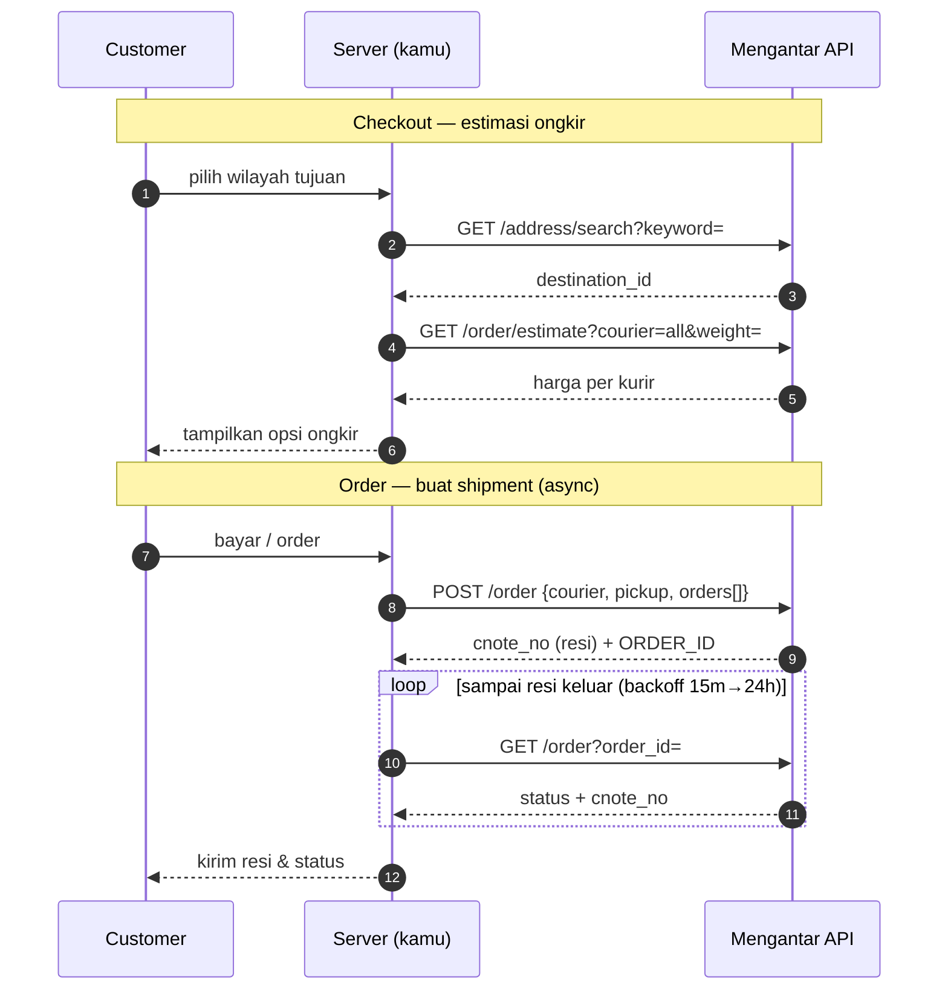

<div align="center">

# 📦 Mengantar API — Dokumentasi Integrasi

**Referensi API ongkir & shipment multi-kurir Indonesia, hasil membedah plugin WooCommerce
"Woo Mengantar" v1.0.32 — disusun ulang agar bisa dipakai di stack apa pun (Astro, Next.js, dan lainnya).**

-orange)


</div>

---

## 🎯 Apa ini?

Mengantar.com adalah **agregator logistik** Indonesia: satu API untuk cek ongkir banyak kurir,
membuat shipment, menjadwalkan pickup, dan melacak resi. API publiknya **tidak punya dokumentasi
resmi** — dokumen ini merekonstruksinya dari kode plugin resmi mereka, lalu menyajikannya sebagai
referensi netral + panduan implementasi headless.

> **Status:** belum ada akun/API key. Fokus dokumen = *cara kerja* & *jalur API*. Begitu key tersedia,
> jalankan smoke-test ([09](09-curl-examples.md)) dan lengkapi schema ([10](10-verification-checklist.md)).

---

## 🗺️ Arsitektur (cara kerja)



**Prinsip kunci:** API key **tidak pernah** sampai ke browser — semua panggilan lewat server,
dengan caching GET, redaksi key di log, queue + retry untuk create shipment, dan polling resi berbackoff.

---

## 🔄 Alur inti



---

## 🌐 Endpoint utama

| Method | Endpoint (`{BASE}/api/public/{KEY}`) | Fungsi |
|--------|--------------------------------------|--------|
| GET | `/address/search?keyword=` | Cari wilayah tujuan → `destination_id` |
| GET | `/address` | List alamat pickup → `origin_id` |
| POST | `/address` | Buat / update alamat pickup |
| GET | `/order/estimate?…` | Estimasi ongkir (+ `allEstimate3PL`) |
| POST | `/order` | Buat shipment → `cnote_no` + `ORDER_ID` |
| GET | `/order?order_id=` / `?tracking_id=` | Lacak status |
| GET·POST·DELETE | `/time` | Jadwal pickup |
| GET | `/invoices` | Invoice akun |

**Auth:** API key di **path** (`/api/public/{KEY}/…`), bukan header. **Response:** JSON, selalu ada `success`.

---

## 🧩 Bisa diimplementasikan ke mana?

API ini **stack-agnostic** — yang dibutuhkan hanya kemampuan memanggil HTTP dari sisi server.
Dokumen menyediakan contoh siap-pakai untuk dua jalur populer, tapi polanya berlaku universal:

| Target | Cara | Status di repo |
|--------|------|----------------|
| **Astro** (+ Cloudflare/Node) | Server endpoints (`src/pages/api/*`) | ✅ contoh lengkap → [05](05-integration-astro.md) |
| **Next.js** (App Router, Vercel) | Route Handlers / Server Actions | ✅ contoh lengkap → [06](06-integration-nextjs.md) |
| **Node/Express, Hono, Nest** | Fungsi `request()` yang sama | ♻️ adaptasi dari 05/06 |
| **PHP / Laravel, Python / FastAPI, Go** | Port `request()` (key di path, cache GET) | ♻️ ikuti [01](01-api-reference.md) + [04](04-how-it-works.md) |
| **Serverless** (CF Workers, Vercel, Lambda) | Proxy + cache di edge/function | ♻️ sesuai pola server-only |
| **Database** (Supabase/Postgres/MySQL) | Skema dari [03](03-data-model.md) (tabel shipments + provenance) | ✅ kamus data siap pakai |
| **Otomasi** (queue/cron) | Create async + polling resi | ✅ pola di [04](04-how-it-works.md) |
| **Codegen client** | `openapi-mengantar.draft.yaml` | ⚠️ draft, verifikasi response |

> Syarat minimum: (1) panggil API **dari server** saja, (2) simpan `origin_id` & `destination_id`,
> (3) normalisasi nama wilayah, (4) buat shipment via job + polling resi. Sisanya bebas.

---

## 📚 Isi dokumentasi

| # | File | Isi |
|---|------|-----|
| 01 | [api-reference](01-api-reference.md) | REST lengkap: auth, semua endpoint, request/response, cek koneksi, caching |
| 02 | [couriers-and-rules](02-couriers-and-rules.md) | Kurir (pemetaan 3 ruang-nama), batas berat/COD, fee, volumetrik, pickup |
| 03 | [data-model](03-data-model.md) | Kamus data: entri shipment, provenance, meta, normalisasi wilayah, kolom import/export |
| 04 | [how-it-works](04-how-it-works.md) | Arsitektur & alur: checkout→rate, order→shipment, origin optimizer, polling, keamanan |
| 05 | [integration-astro](05-integration-astro.md) | Integrasi Astro (client server-only + endpoints) |
| 06 | [integration-nextjs](06-integration-nextjs.md) | Integrasi Next.js (Route Handlers / Server Actions) |
| 07 | [reference](07-reference.md) | Glosarium, matriks field wajib/opsional, enum, tabel opsi konfigurasi |
| 08 | [error-catalog](08-error-catalog.md) | Katalog error (API vs validasi vs operasional) + pola penanganan |
| 09 | [curl-examples](09-curl-examples.md) | cURL siap-pakai semua endpoint + urutan smoke-test |
| 10 | [verification-checklist](10-verification-checklist.md) | Hal yang harus diverifikasi saat API key tersedia |
| — | [openapi-mengantar.draft.yaml](openapi-mengantar.draft.yaml) | Spec OpenAPI 3.1 (draft, untuk codegen) |

**Urutan baca disarankan:** `01 → 02 → 03 → 04`, lalu pilih `05`/`06` sesuai stack; `07`–`10` sebagai lampiran.

---

## ⚡ Mulai cepat (saat key sudah ada)

```bash
export MGT_KEY="API_KEY"; export MGT_BASE="https://api-public.mengantar.com"
export MGT_PREFIX="$MGT_BASE/api/public/$MGT_KEY"

# 1) Validasi key
curl -sS "$MGT_PREFIX/order/estimate?origin_id=5fc62f63f8f44b34aa4c0e0a&destination_id=5fc62de8f8f44b34aa4bdc58&courier=all&weight=1" | jq .success
# 2) Cari tujuan → 3) estimasi → 4) buat shipment ... (lihat 09-curl-examples.md)
```

---

## 🔑 Fakta penting (hasil pembedahan)

- 🏷️ Nomor resi = **`cnote_no`** (bukan `tracking_id`); response create `data` berupa **array**.
- 🚚 `courier` untuk create order memakai **8 nama resmi** (`JNE`, `SiCepat`, `Sap`, `iDexpress`, `JT`, `Ninja`, `lion`, `anteraja`) — beda dari key estimasi.
- 💰 `COD` per item = nilai barang + porsi ongkir + porsi fee COD (proporsional).
- 🗺️ Nama wilayah dari API **tidak standar** → wajib dinormalisasi ([03](03-data-model.md) §6).
- 🔌 Tidak ada endpoint validasi key khusus — plugin pakai estimate dummy ([01](01-api-reference.md) §10).
- 📭 Tidak ada indikasi webhook — status diambil via **polling** (perlu konfirmasi).

---

## ⚠️ Disclaimer

API Mengantar tidak punya dokumentasi publik resmi. Semua di sini diturunkan dari **kode plugin**,
bukan dari spesifikasi vendor. Field yang dipakai plugin sudah dikonfirmasi dari kode; field lain
mungkin ada tapi tak terpakai. **Verifikasi dengan akun + sandbox sebelum produksi** (lihat [10](10-verification-checklist.md)).
Repo privat untuk dokumentasi internal — bukan afiliasi resmi Mengantar.com.
