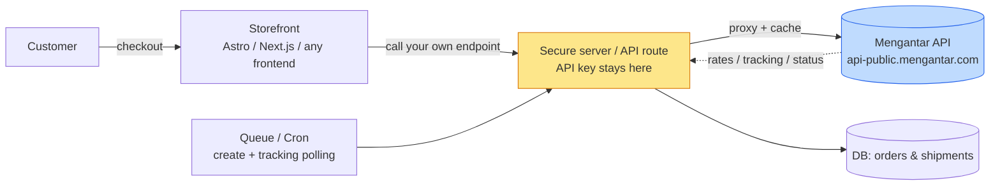
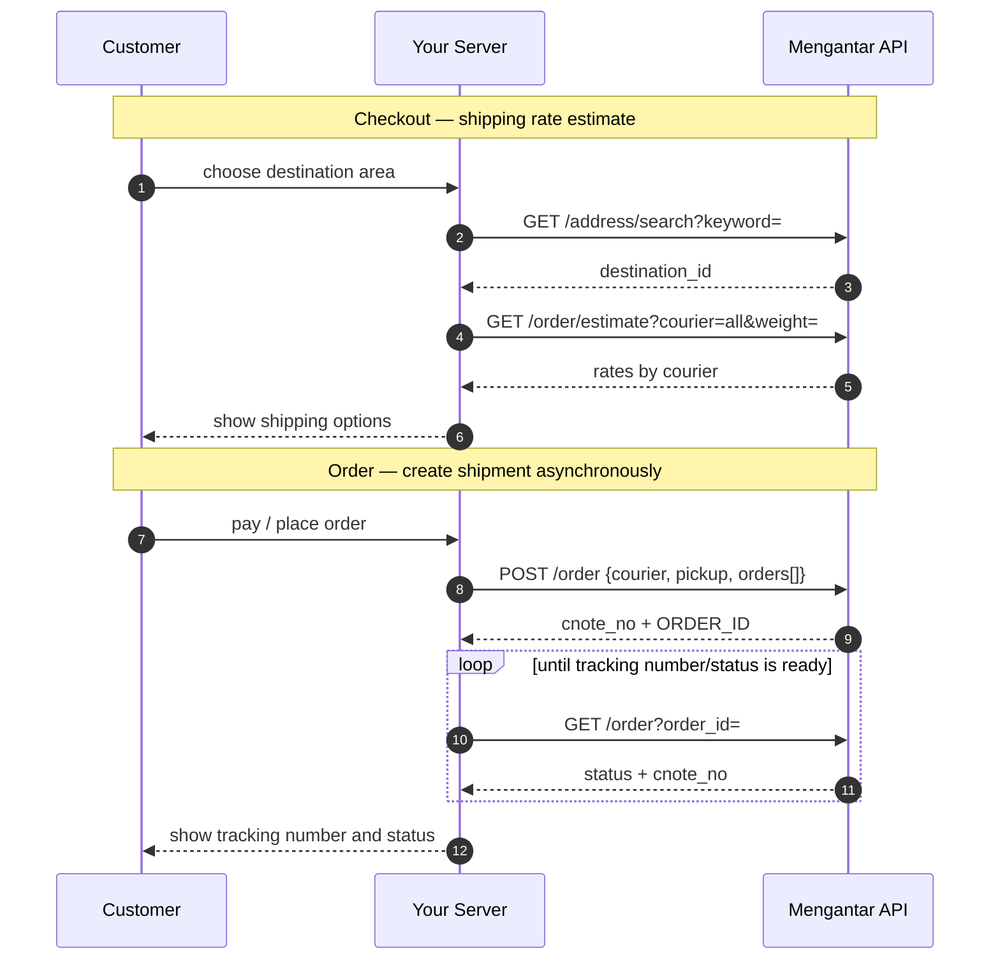

<div align="center">


# Mengantar API Integration Documentation

**Integration documentation and toolkit for Mengantar's Indonesia multi-courier shipping API — curated by [ongki.pro](https://ongki.pro), Official Partner Mengantar.**

Use it with any server-capable stack: **Astro**, **Next.js**, Node, Hono, Laravel, Python, Go, serverless functions, or your own backend.

[](https://ongki.pro)
[](https://ongki.pro)
[](https://github.com/ongkipro/mengantar-documentation/actions/workflows/ci.yml)


[](LICENSE)
[](CHANGELOG.md)


</div>

---

## What this is

Mengantar.com is an Indonesian logistics aggregator: one API for multi-courier shipping rates, shipment creation, pickup scheduling, and tracking.

As an **Official Partner Mengantar**, [ongki.pro](https://ongki.pro) maintains this documentation to help teams integrate Mengantar into storefronts, headless commerce projects, and backend systems.

> **Verified:** endpoints, parameters, and response shapes here are matched against the official docs (`app.mengantar.com/docs`) and **verified live against the production API** (read-only, 2026-07-03). Operational behaviour (caching, validation, base URL) is derived from the WooCommerce plugin and marked **[plugin]**.

> **API access:** this repository does not provide API keys. To request production/sandbox API access, contact the official Mengantar platform/team. After you receive a key, run the smoke tests in [09-curl-examples](docs/09-curl-examples.md) and complete the [10-verification-checklist](docs/10-verification-checklist.md).

> **Language note:** this README is written in English for public discoverability. The detailed integration documents may remain in Indonesian where it is more practical for implementation teams.

**Contents:** [Architecture](#architecture) · [Core flow](#core-flow) · [Endpoints](#endpoints-18-total) · [Repository layout](#repository-layout) · [Where to implement](#where-it-can-be-implemented) · [Docs index](#documentation-index) · [Quick start](#quick-start-after-you-receive-an-api-key) · [Important notes](#important-implementation-notes) · [API access](#api-access-request) · [Changelog](#changelog)

---

## Architecture



**Key principle:** the API key must never reach the browser. All calls go through your server, with GET caching, key redaction in logs, queue/retry for shipment creation, and backoff-based tracking polling.

---

## Core flow



---

## Endpoints (18 total)

| Method | Endpoint (`{BASE}/api/public/{KEY}`) | Purpose |
| --- | --- | --- |
| GET | `/address/search?keyword=` | Search area → `origin_id` / `destination_id` |
| POST · GET | `/address` | Create/update · list pickup addresses |
| POST · GET | `/time` | Add · list pickup schedule |
| GET | `/order/estimate?...` | Shipping rate (single / `all`) |
| GET | `/api/order/allEstimatePublic` · `…/allEstimate3PL` **(no-key)** | All couriers (flat 20% · 3PL) |
| POST | `/order/getPerformancePublic` | Courier performance score |
| GET | `/invoices` | Invoices + balance |
| POST | `/order` | Create shipment → `cnote_no` + `ORDER_ID` |
| GET | `/my-users` | List assignees |
| POST | `/order/pay-unpaid` | Pay unpaid orders |
| GET · DELETE | `/order` | List/track · delete orders |
| GET · DELETE | `/batch` | List · delete batches |
| GET | `/getReceiverScoreByNumberUser?search=` | Receiver score (RTS risk) |

**Auth:** API key is placed in the path (`/api/public/{KEY}/...`), not in headers. **Response:** JSON, normally with a `success` field. Official error codes: `X000`–`X003` + `409` (batch concurrency). Full reference → [01](docs/01-api-reference.md).

---

## Repository layout

```
.
├── README.md                 # this file
├── AGENTS.md  (= CLAUDE.md)   # contract for AI coding agents (integration golden rules)
├── Makefile                  # terminal entrypoint: make check | client-check | smoke
├── docs/                     # 01–10 canonical documentation
├── spec/openapi.yaml         # OpenAPI 3.1 — 18 endpoints (codegen)
├── examples/                 # server-only TypeScript client + usage & recipes
├── scripts/                  # check-links.sh (validation) · smoke.sh (read-only API test)
├── requests.http             # REST-client file (VS Code / JetBrains)
├── .env.example              # credential template (→ .env)
└── CONTRIBUTING.md · SECURITY.md · CHANGELOG.md · LICENSE
```

> **Building on this repo (human or AI)?** Read **[AGENTS.md](AGENTS.md)** first — golden rules
> (server-only key, `COD_AMOUNT` casing, `mm-dd-yyyy` date, batch concurrency, the two "origin" IDs)
> and how to keep files in sync. Ready-to-use client: **[examples/](examples/README.md)**.

**Terminal quick commands:**
```bash
make help          # list commands
make check         # validate spec + links + hygiene (offline)
make client-check  # typecheck the TS client (tsc --strict)
cp .env.example .env && make smoke   # READ-ONLY smoke test against the API (fill key first)
```

---

## Where it can be implemented

The API is stack-agnostic. You only need server-side HTTP calls.

| Target | Pattern | Status in this repo |
| --- | --- | --- |
| **Astro** + Cloudflare/Node | Server endpoints (`src/pages/api/*`) | Complete example → [05](docs/05-integration-astro.md) |
| **Next.js** App Router / Vercel | Route Handlers / Server Actions | Complete example → [06](docs/06-integration-nextjs.md) |
| **Node/Express, Hono, Nest** | Shared `request()` helper | Adapt from 05/06 or use `examples/` |
| **PHP / Laravel, Python / FastAPI, Go** | Port the request helper; keep key server-side | Follow [01](docs/01-api-reference.md) + [04](docs/04-how-it-works.md) |
| **Serverless** Cloudflare Workers, Vercel, Lambda | Proxy + cache at edge/function layer | Follow server-only pattern |
| **Database** Supabase/Postgres/MySQL | Shipments model + SQL schema | Data model → [03](docs/03-data-model.md) §0 |
| **Automation** queue/cron | Async create + tracking polling | Flow → [04](docs/04-how-it-works.md) |
| **Codegen client** | OpenAPI 3.1, 18 endpoints | [spec/openapi.yaml](spec/openapi.yaml) · typed TS: `examples/mengantar-client.ts` |

Minimum requirements:

1. call Mengantar only from the server
2. store `origin_id` (area) and `destination_id`
3. normalise area names
4. create shipments via a job/queue
5. poll tracking status with backoff

---

## Documentation index

| # | File | Contents |
| --- | --- | --- |
| 01 | [api-reference](docs/01-api-reference.md) | REST auth, **18 endpoints** (official docs), request/response, error codes X000–X003, connection checks, caching |
| 02 | [couriers-and-rules](docs/02-couriers-and-rules.md) | Courier mapping, weight/COD limits, fees, volumetric rules, pickup, batch concurrency |
| 03 | [data-model](docs/03-data-model.md) | Order object (API) + SQL schema, provenance, metadata, area normalisation, import/export columns |
| 04 | [how-it-works](docs/04-how-it-works.md) | Architecture and workflow: checkout→rate, order→shipment, origin optimisation, polling, security |
| 05 | [integration-astro](docs/05-integration-astro.md) | Astro integration with server-only client and endpoints |
| 06 | [integration-nextjs](docs/06-integration-nextjs.md) | Next.js Route Handlers / Server Actions integration |
| 07 | [reference](docs/07-reference.md) | Glossary, required/optional fields, enums, configuration matrix |
| 08 | [error-catalog](docs/08-error-catalog.md) | API/validation/operational errors and handling patterns |
| 09 | [curl-examples](docs/09-curl-examples.md) | Ready-to-run cURL examples and smoke-test order |
| 10 | [verification-checklist](docs/10-verification-checklist.md) | Verification steps + what is already confirmed live |
| — | [spec/openapi.yaml](spec/openapi.yaml) | OpenAPI 3.1 spec — 18 endpoints, matched to official docs |

Recommended reading order: `01 → 02 → 03 → 04`, then choose `05` or `06` based on your stack. Use `07–10` as implementation references.

---

## Quick start after you receive an API key

```bash
export MGT_KEY="YOUR_API_KEY"
export MGT_BASE="https://api-public.mengantar.com"
export MGT_PREFIX="$MGT_BASE/api/public/$MGT_KEY"

# 1) Validate key by running a shipping estimate smoke test
curl -sS "$MGT_PREFIX/order/estimate?origin_id=5fc62f63f8f44b34aa4c0e0a&destination_id=5fc62de8f8f44b34aa4bdc58&courier=all&weight=1" | jq .success

# 2) Search destination → 3) estimate rate → 4) create shipment
# See docs/09-curl-examples.md for the full sequence, or run: make smoke
```

### Or use the typed TypeScript client

Server-only, zero-dependency, covers all 18 endpoints ([examples/](examples/README.md)):

```ts
import { MengantarClient } from "./examples/mengantar-client";

const mgt = new MengantarClient({ apiKey: process.env.MENGANTAR_API_KEY! });

const [dest]   = await mgt.searchAddress("Menteng");
const originId = await mgt.originWilayah();          // area _id for estimates (= PICKUP_AUTOFILL)
const rates    = await mgt.estimate({ originId, destinationId: dest._id, courier: "all", weight: 2 });
```

---

## Important implementation notes

- Tracking number is `cnote_no` (not `tracking_id`); create-order `data` is an **array**.
- **Two different "origin" IDs** (live-verified): estimate `origin_id`/`destination_id` are **area `_id`s** (from `/address/search`, or a pickup's `PICKUP_AUTOFILL`) — *not* the pickup-address `_id`. Create-order `pickup.address_id` and `/time?address=` use the **pickup-address `_id`**. Mixing them up returns `success:false`.
- Courier names for create-order use Mengantar's official casing: `JNE`, `SiCepat`, `Sap`, `iDexpress`, `JT`, `Ninja`, `lion`, `anteraja`. Estimate `courier` defaults to `JNE`.
- `POST /time` uses `date` in **`mm-dd-yyyy`** (not ISO) plus fixed `9:00`–`18:00` slots.
- **JT Premium / Ninja / SiCepat**: one batch per account — parallel batches return `409 Conflict`.
- COD estimate param is **`COD_AMOUNT`** (uppercase) = item value + shipping; low balance → order stays **unpaid** (pay via `/order/pay-unpaid`).
- API area names may not be standardised; normalisation is required.
- No dedicated key-validation endpoint; use a safe estimate smoke test.
- Webhook availability is unconfirmed; design tracking with polling/backoff.

---

## API access request

To use this documentation against the real Mengantar API, request access directly from the official Mengantar platform/team.

This repository is documentation and integration guidance only. It does not include or distribute API keys — see [SECURITY.md](SECURITY.md) for key handling.

After access is granted:

1. run the smoke tests in [09-curl-examples](docs/09-curl-examples.md) (or `make smoke`)
2. complete the [10-verification-checklist](docs/10-verification-checklist.md)
3. update the OpenAPI schema if any real responses differ
4. keep the API key server-side only

---

## Changelog

**Last updated: 2026-07-03.** Recent highlights — full history in [CHANGELOG.md](CHANGELOG.md).

| Date | Change |
| --- | --- |
| 2026-07-03 | **Live-verified** against the production API (read-only): base URL confirmed, the two-origin-ID rule fixed across docs & client, `courier=all` returns 14–15 couriers. |
| 2026-07-03 | **Dev-ready repo:** `docs/` `spec/` `examples/` `scripts/`, AGENTS.md, TypeScript client, Makefile, smoke test, `requests.http`, CI, LICENSE/SECURITY/CONTRIBUTING. |
| 2026-07-03 | **Aligned with official docs:** 18 endpoints, error codes `X000`–`X003` + `409`, fixed `mm-dd-yyyy` date & `COD_AMOUNT` casing; OpenAPI 3.1 spec. |
| 2026-06-30 | Initial release: documentation reverse-engineered from the WooCommerce plugin. |

---

## About

This documentation and toolkit is curated by **[ongki.pro](https://ongki.pro)** — Official Partner Mengantar.

We help teams integrate Mengantar into headless storefronts, ecommerce backends, and automation systems for shipping rates, shipment creation, pickup scheduling, and tracking.

**Governance:** [AGENTS.md](AGENTS.md) · [CONTRIBUTING.md](CONTRIBUTING.md) · [SECURITY.md](SECURITY.md) · [CHANGELOG.md](CHANGELOG.md) · [LICENSE](LICENSE)

<div align="center">

[ongki.pro](https://ongki.pro) · Official Partner Mengantar

</div>
