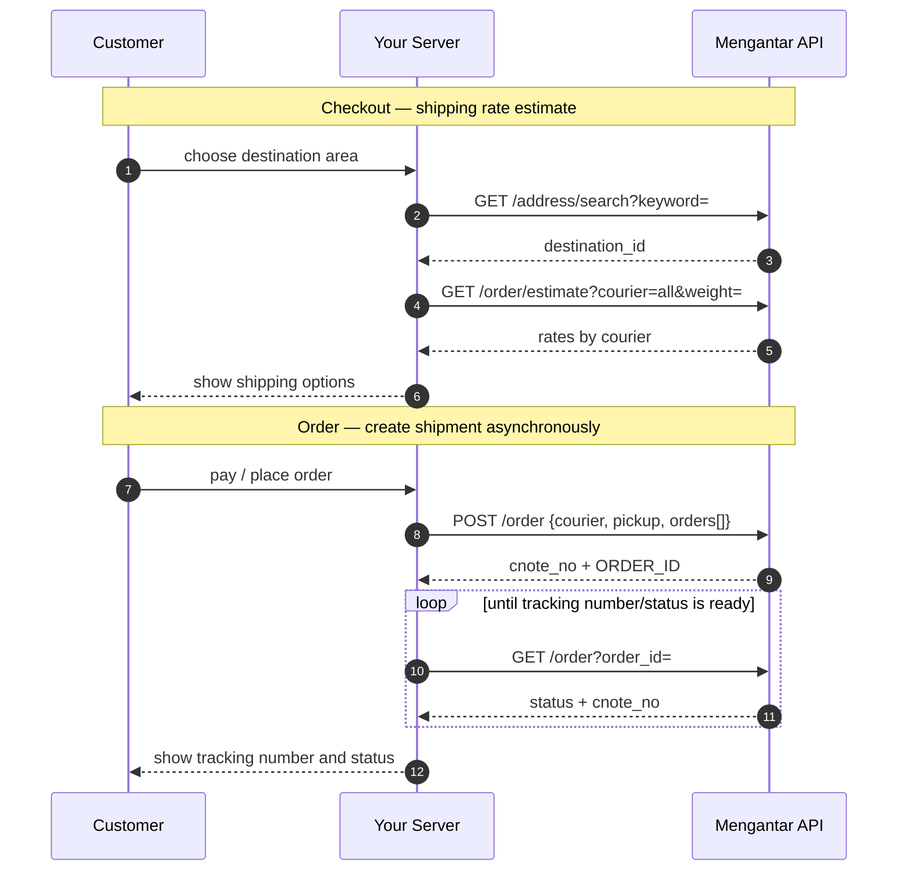

<div align="center">


# Mengantar API Integration Documentation

**Integration documentation and toolkit for Mengantar's Indonesia multi-courier shipping API — curated by [ongki.pro](https://ongki.pro), Official Partner Mengantar.**

Use it with any server-capable stack: **Astro**, **Next.js**, Node, Hono, Laravel, Python, Go, serverless functions, or your own backend.

[](https://ongki.pro)
[](https://ongki.pro)


</div>

---

## What this is

Mengantar.com is an Indonesian logistics aggregator: one API for multi-courier shipping rates, shipment creation, pickup scheduling, and tracking.

As an **Official Partner Mengantar**, [ongki.pro](https://ongki.pro) maintains this documentation to help teams integrate Mengantar into storefronts, headless commerce projects, and backend systems.

> **API access:** this repository does not provide API keys. To request production/sandbox API access, please contact the official Mengantar platform/team. After you receive an API key, run the smoke tests in [09-curl-examples](09-curl-examples.md) and complete the verification checklist in [10-verification-checklist](10-verification-checklist.md).

> **Language note:** this README is written in English for public discoverability. The detailed integration documents in this repository may remain in Indonesian where it is more practical for implementation teams.

---

## Architecture


**Key principle:** the API key must never reach the browser. All calls should go through your server, with GET caching, key redaction in logs, queue/retry for shipment creation, and backoff-based tracking polling.

---

## Core flow



---

## Main endpoints

| Method | Endpoint (`{BASE}/api/public/{KEY}`) | Purpose |
| --- | --- | --- |
| GET | `/address/search?keyword=` | Search destination area → `destination_id` |
| GET | `/address` | List pickup addresses → `origin_id` |
| POST | `/address` | Create/update pickup address |
| GET | `/order/estimate?...` | Shipping rate estimate, including `allEstimate3PL` |
| POST | `/order` | Create shipment → `cnote_no` + `ORDER_ID` |
| GET | `/order?order_id=` / `?tracking_id=` | Track order status |
| GET / POST / DELETE | `/time` | Pickup schedule |
| GET | `/invoices` | Account invoices |

**Auth:** API key is placed in the path (`/api/public/{KEY}/...`), not in headers.  
**Response:** JSON, normally with a `success` field.

---

## Where it can be implemented

The API is stack-agnostic. You only need server-side HTTP calls.

| Target | Pattern | Status in this repo |
| --- | --- | --- |
| **Astro** + Cloudflare/Node | Server endpoints (`src/pages/api/*`) | Complete example → [05](05-integration-astro.md) |
| **Next.js** App Router / Vercel | Route Handlers / Server Actions | Complete example → [06](06-integration-nextjs.md) |
| **Node/Express, Hono, Nest** | Shared `request()` helper | Adapt from 05/06 |
| **PHP / Laravel, Python / FastAPI, Go** | Port the request helper; keep key server-side | Follow [01](01-api-reference.md) + [04](04-how-it-works.md) |
| **Serverless** Cloudflare Workers, Vercel, Lambda | Proxy + cache at edge/function layer | Follow server-only pattern |
| **Database** Supabase/Postgres/MySQL | Shipments + provenance model | Data model → [03](03-data-model.md) |
| **Automation** queue/cron | Async create + tracking polling | Flow → [04](04-how-it-works.md) |
| **Codegen client** | OpenAPI draft | `openapi-mengantar.draft.yaml` pending verification |

Minimum requirements:

1. call Mengantar only from the server
2. store `origin_id` and `destination_id`
3. normalise area names
4. create shipments via a job/queue
5. poll tracking status with backoff

---

## Documentation index

| # | File | Contents |
| --- | --- | --- |
| 01 | [api-reference](01-api-reference.md) | REST auth, endpoints, request/response patterns, connection checks, caching |
| 02 | [couriers-and-rules](02-couriers-and-rules.md) | Courier mapping, weight/COD limits, fees, volumetric rules, pickup |
| 03 | [data-model](03-data-model.md) | Shipment data dictionary, provenance, metadata, area normalisation, import/export columns |
| 04 | [how-it-works](04-how-it-works.md) | Architecture and workflow: checkout→rate, order→shipment, origin optimisation, polling, security |
| 05 | [integration-astro](05-integration-astro.md) | Astro integration with server-only client and endpoints |
| 06 | [integration-nextjs](06-integration-nextjs.md) | Next.js Route Handlers / Server Actions integration |
| 07 | [reference](07-reference.md) | Glossary, required/optional fields, enums, configuration matrix |
| 08 | [error-catalog](08-error-catalog.md) | API/validation/operational errors and handling patterns |
| 09 | [curl-examples](09-curl-examples.md) | Ready-to-run cURL examples and smoke-test order |
| 10 | [verification-checklist](10-verification-checklist.md) | Verification steps after API key is available |
| — | [openapi-mengantar.draft.yaml](openapi-mengantar.draft.yaml) | Draft OpenAPI 3.1 spec for codegen; response schema must be verified |

Recommended reading order: `01 → 02 → 03 → 04`, then choose `05` or `06` based on your stack. Use `07–10` as implementation references.

---

## Quick start after you receive an API key

```bash
export MGT_KEY="YOUR_API_KEY"
export MGT_BASE="https://api-public.mengantar.com"
export MGT_PREFIX="$MGT_BASE/api/public/$MGT_KEY"

# 1) Validate key by running a shipping estimate smoke test
curl -sS "$MGT_PREFIX/order/estimate?origin_id=5fc62f63f8f44b34aa4c0e0a&destination_id=5fc62de8f8f44b34aa4bdc58&courier=all&weight=1" | jq .success

# 2) Search destination → 3) estimate rate → 4) create shipment
# See 09-curl-examples.md for the full sequence.
```

---

## Important implementation notes

- Tracking number is `cnote_no`, not always `tracking_id`.
- Create-order response `data` may be an array.
- Courier names for create-order use Mengantar's official naming, which can differ from estimation keys.
- COD per item should include item value + proportional shipping + proportional COD fee.
- API area names may not be standardised; normalisation is required.
- There may be no dedicated key-validation endpoint; use a safe estimate smoke test.
- Webhook availability must be confirmed; tracking should be designed with polling/backoff.

---

## API access request

To use this documentation against the real Mengantar API, request access directly from the official Mengantar platform/team.

This repository is documentation and integration guidance only. It does not include or distribute API keys.

After access is granted:

1. run the smoke tests in [09-curl-examples](09-curl-examples.md)
2. complete [10-verification-checklist](10-verification-checklist.md)
3. update the draft OpenAPI schema if any real responses differ
4. keep the API key server-side only

---

## About

This documentation and toolkit is curated by **[ongki.pro](https://ongki.pro)** — Official Partner Mengantar.

We help teams integrate Mengantar into headless storefronts, ecommerce backends, and automation systems for shipping rates, shipment creation, pickup scheduling, and tracking.

<div align="center">

[ongki.pro](https://ongki.pro) · Official Partner Mengantar

</div>
